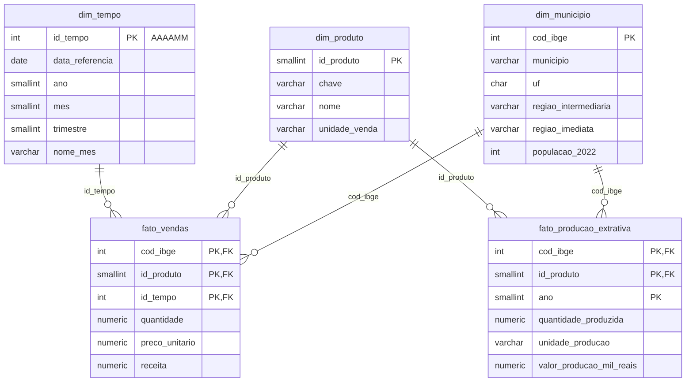

# Previsão de Alta Demanda de Produtos da Bioeconomia Amazônica

Projeto Integrador (P15) da disciplina **Banco de Dados e Engenharia de Dados para IA**, Prof. Adolfo Colares, Especialização em Inteligência Artificial da [UNIFAP – Universidade Federal do Amapá](https://www.unifap.br/).

Autor: Leonam Souza dos Santos Azevedo

## Objetivo

Construir um pipeline end-to-end de Engenharia de Dados e Machine Learning que prevê se um município terá **alta ou baixa demanda** de um produto da bioeconomia (açaí, castanha-do-pará e óleo de copaíba) em determinado mês, nos estados do Amapá, Pará e Amazonas.

```
Fontes de Dados → PostgreSQL → ETL Python → Features → Machine Learning → Métricas → Resultados
```

## Fontes de dados

| # | Fonte | Tipo | O que fornece | Arquivo bruto |
|---|-------|------|---------------|---------------|
| 1 | [API de Localidades do IBGE](https://servicodados.ibge.gov.br/api/docs/localidades) | Pública, real | Municípios de AP, PA e AM e suas regiões geográficas | `ibge_municipios_<UF>.json` |
| 2 | [SIDRA tabela 4709](https://sidra.ibge.gov.br/tabela/4709) (Censo 2022) | Pública, real | População residente por município | `sidra_4709_populacao_<UF>.json` |
| 3 | [SIDRA tabela 289](https://sidra.ibge.gov.br/tabela/289) (PEVS) | Pública, real | Produção extrativa (quantidade e valor) por município, produto e ano | `sidra_289_pevs_<UF>_<ANO>.json` |
| 4 | Relatório de vendas | **Simulada** | Vendas mensais por município e produto (jan/2022 a dez/2024) | `vendas_simuladas.csv` |

### Sobre a fonte simulada

Não existe base pública de vendas mensais desses produtos por município, então as vendas são **simuladas** pelo script `src/gerar_vendas.py`, ancoradas nos dados reais do IBGE:

- a demanda cresce com a **população** do município (Censo 2022);
- a demanda e o preço respondem à **produção extrativa do ano anterior** (PEVS), pois a PEVS de um ano só é publicada no ano seguinte;
- há **sazonalidade simplificada** por produto (pico do açaí em outubro, da castanha em fevereiro, copaíba quase estável);
- há **tendência** de crescimento de 5% ao ano e **ruído com memória** (AR(1));
- o preço cai na safra e onde há mais produção local.

Os parâmetros da simulação estão em `src/config.py` e a semente aleatória é fixa (`SEED = 42`), então a base é reproduzível.

### Problemas de qualidade inseridos de propósito

Para que o ETL tenha o que tratar, como numa base real, o gerador insere:

| Problema | Proporção | Como o ETL vai tratar |
|----------|-----------|-----------------------|
| Nome do produto com grafias diferentes (`acai`, `AÇAÍ`, `castanha do para`...) | 15% | Padronização por texto normalizado |
| Mês em formato `MM/AAAA` em vez de `AAAA-MM` | 10% | Conversão para data única |
| Nome do município em caixa alta | 5% | Uso do código IBGE como chave |
| Código IBGE ausente | 0,5% | Recuperação por nome do município + UF |
| Preço unitário ausente | 1,5% | Recálculo por receita / quantidade |
| Quantidade 100x maior (erro de digitação) | 0,3% | Detecção pelo preço implícito e correção |
| Quantidade com sinal trocado | 0,2% | Correção do sinal |
| Linhas duplicadas | 0,8% | Remoção de duplicatas |

## Estrutura do repositório

```
p15-projeto-integrador/
├── README.md
├── requirements.txt
├── .env.example          # modelo da conexão com o PostgreSQL
├── data/
│   ├── raw/              # dados brutos, exatamente como recebidos
│   └── processed/        # dados tratados pelo ETL
├── sql/
│   ├── 01_estrutura.sql            # Etapa 2: schemas, tabelas, chaves e índices
│   └── 02_verificacao_staging.sql  # Etapa 2: consultas de verificação
├── src/
│   ├── config.py         # escopo, parâmetros e caminhos
│   ├── utils.py          # leitura dos formatos do IBGE
│   ├── db.py             # conexão com o PostgreSQL (lê o .env)
│   ├── extract.py        # Etapa 1: coleta das fontes públicas
│   ├── gerar_vendas.py   # Etapa 1: geração da fonte de vendas simulada
│   ├── setup_db.py       # Etapa 2: cria o banco e a estrutura
│   └── load_staging.py   # Etapa 2: carrega data/raw na staging
├── notebooks/            # análise exploratória e notebook final
├── models/               # modelo treinado
└── reports/              # métricas e resultados
```

## Modelagem no PostgreSQL

O banco `bioeconomia` tem duas camadas, uma por schema:

| Schema | Papel | Características |
|--------|-------|----------------|
| `staging` | Recebe os dados brutos das 4 fontes | Tudo em `TEXT`, sem restrições: guarda o dado exatamente como chegou, inclusive os símbolos do IBGE (`-`, `...`, `X`) e os erros das vendas. Cada linha registra o arquivo de origem e o horário da carga. |
| `dw` | Modelo dimensional (estrela) tratado pelo ETL | Tipos corretos, chaves primárias e estrangeiras, `CHECK` de valores válidos e índices. |

Separar as camadas permite reprocessar o ETL sem baixar os dados de novo e auditar qualquer valor tratado comparando com o original na staging.

### Modelo dimensional (schema `dw`)



Decisões de modelagem:

- **Duas tabelas fato com dimensões compartilhadas:** vendas (mensal) e produção extrativa (anual) têm granularidades diferentes, então ficam em fatos separados ligados pelas mesmas dimensões de município e produto.
- **Chave primária composta na `fato_vendas`** (município, produto, mês): garante no próprio banco que não existe venda duplicada para a mesma combinação.
- **`id_tempo` no formato AAAAMM:** legível e ordenável (ex.: `202410`).
- **`NULL` na produção extrativa significa "dado não disponível no IBGE"**, diferente de zero (símbolo `-` do SIDRA).

## Como executar

Pré-requisitos: Python 3.10+, Git e PostgreSQL (testado nas versões 16 e 18).

No Windows (PowerShell), dentro da pasta do projeto:

```powershell
python -m venv .venv
.\.venv\Scripts\Activate.ps1
pip install -r requirements.txt

# Etapa 1: coleta
python -m src.extract          # baixa as fontes do IBGE para data/raw
python -m src.gerar_vendas     # gera data/raw/vendas_simuladas.csv

# Etapa 2: banco de dados
copy .env.example .env         # depois edite o .env com a senha do PostgreSQL
python -m src.setup_db         # cria o banco bioeconomia e as tabelas
python -m src.load_staging     # carrega data/raw na staging
```

Os arquivos do IBGE ficam em cache em `data/raw/`; para baixar de novo, use `python -m src.extract --force`. Para recriar as tabelas do zero, use `python -m src.setup_db --recriar`.

Para conferir a carga no SQL Shell (psql), a partir da pasta do projeto:

```
\! chcp 65001
\cd 'C:/p15-projeto-integrador'
\i sql/02_verificacao_staging.sql
```

## Andamento

- [x] Etapa 1: estrutura do repositório e coleta de dados (2+ fontes)
- [x] Etapa 2: modelagem no PostgreSQL e carga dos dados brutos (staging)
- [ ] Etapa 3: ETL em Python (staging → modelo dimensional)
- [ ] Etapa 4: análise exploratória (notebook)
- [ ] Etapa 5: engenharia de features
- [ ] Etapa 6: modelo de classificação e métricas
- [ ] Etapa 7: documentação final e notebook de entrega
