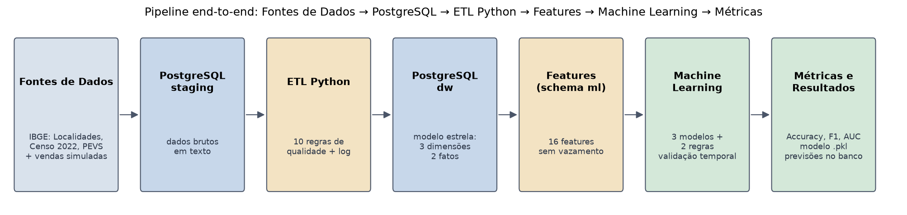
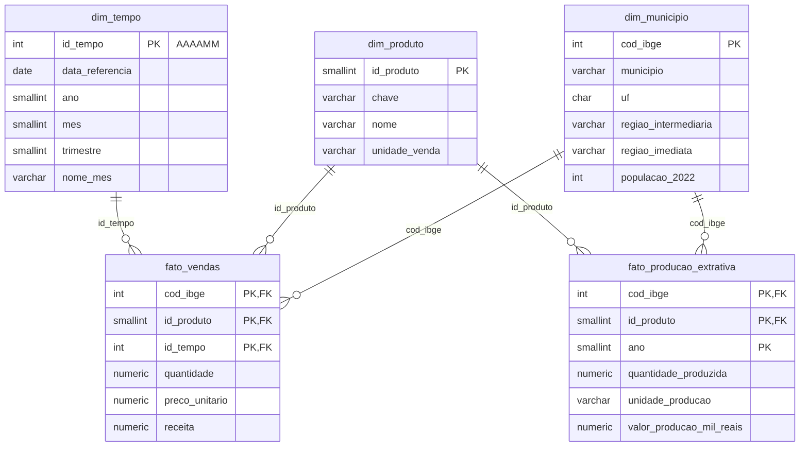

# Previsão de Alta Demanda de Produtos da Bioeconomia Amazônica

Projeto Integrador (P15) da disciplina **Banco de Dados e Engenharia de Dados para IA**, Prof. Adolfo Colares, Especialização em Inteligência Artificial da [UNIFAP – Universidade Federal do Amapá](https://www.unifap.br/).

**Autor:** Leonam Souza dos Santos Azevedo

Pipeline end-to-end de Engenharia de Dados e Machine Learning que prevê, no início de cada mês, se um município do Amapá, Pará ou Amazonas terá **alta demanda** de açaí, castanha-do-pará ou óleo de copaíba, em relação ao seu próprio histórico. A previsão apoia o planejamento de compra, estoque e transporte de cooperativas e comerciantes, reduzindo falta de produto e desperdício de itens perecíveis.



## Sumário

1. [Resultados](#resultados)
2. [Onde está cada exigência do enunciado](#onde-está-cada-exigência-do-enunciado)
3. [Como executar](#como-executar)
4. [Fontes de dados](#fontes-de-dados)
5. [Armazenamento no PostgreSQL](#armazenamento-no-postgresql)
6. [ETL em Python](#etl-em-python)
7. [Análise exploratória](#análise-exploratória)
8. [Engenharia de features](#engenharia-de-features)
9. [Modelo de classificação](#modelo-de-classificação)
10. [Estrutura do repositório](#estrutura-do-repositório)
11. [Limitações e próximos passos](#limitações-e-próximos-passos)

## Resultados

Teste em 2024 (7.990 registros), com o modelo escolhido pela validação temporal em 2023:

| Modelo | F1 na validação (2023) | Accuracy | F1 | Precisão | Recall | AUC |
|--------|:---:|:---:|:---:|:---:|:---:|:---:|
| Regra: repetir o mês anterior | 0,754 | 0,737 | 0,733 | 0,731 | 0,734 | 0,737 |
| Regra: época de safra (índice sazonal > 1) | 0,767 | 0,717 | 0,707 | 0,721 | 0,693 | 0,795 |
| **Regressão logística (modelo final)** | **0,797** | **0,774** | **0,772** | 0,764 | 0,779 | **0,861** |
| Random Forest | 0,775 | 0,775 | 0,773 | 0,766 | 0,780 | 0,858 |
| Gradient Boosting | 0,796 | 0,771 | 0,769 | 0,762 | 0,776 | 0,858 |

- **O modelo supera as regras de referência:** +3,9 pontos de F1, +3,7 de Accuracy e +12,4 de AUC sobre "repetir o mês anterior". Os erros estão equilibrados (943 falsos positivos e 866 falsos negativos).
- **O ganho está nas viradas de demanda:** em 26% dos meses a demanda muda de estado; a regra simples erra todos esses casos, e o modelo acerta **37%**, principalmente na entrada e na saída da safra.
- **Features importam mais que o algoritmo:** os três modelos ficaram próximos, e a validação escolheu o mais simples e interpretável. O modelo se apoia principalmente na razão do mês anterior e no índice sazonal histórico.
- **O desempenho acompanha a força da sazonalidade:** F1 de 0,833 no açaí, 0,779 na castanha-do-pará e 0,707 no óleo de copaíba.
- **Probabilidades úteis para decidir:** quando o modelo está confiante (85% dos casos), o acerto é de 81,5%.
- **Sem sobreajuste:** a queda do F1 entre 2023 e 2024 também aparece nas regras, que não aprendem nada; 2024 foi um ano um pouco mais difícil de prever.


A análise completa está em [`notebooks/04_entrega_final.ipynb`](notebooks/04_entrega_final.ipynb).

## Onde está cada exigência do enunciado

| Exigência | Onde está |
|-----------|-----------|
| Coleta de 2 ou mais fontes | 4 fontes: `src/extract.py` (3 fontes públicas do IBGE) e `src/gerar_vendas.py` (vendas simuladas); dados brutos em `data/raw/` |
| Armazenamento em PostgreSQL com modelagem adequada | `sql/01_estrutura.sql`: schemas `staging`, `dw` (modelo estrela) e `ml`; `src/setup_db.py` e `src/load_staging.py` |
| ETL em Python | `src/transform.py` (regras) e `src/etl.py` (orquestração), com relatório em `reports/qualidade_etl.csv` |
| Preparação e criação de features | `src/features.py` e `src/build_features.py`; notebook `02_features.ipynb` com teste automático de vazamento |
| Modelo de classificação | `src/modelagem.py` e `src/train.py`; modelo salvo em `models/modelo_alta_demanda.pkl` |
| Avaliação com métricas adequadas | Accuracy, F1, precisão, recall e AUC em `reports/metricas_modelos.csv`, `ml.metricas_modelos` e `03_modelo.ipynb` |
| Notebook de análise exploratória | `notebooks/01_eda.ipynb` |
| Documentação | Este README, docstrings em todos os scripts e os quatro notebooks |
| Reprodutibilidade | `python -m src.pipeline` executa tudo, da coleta ao modelo, com resultados idênticos |

## Como executar

**Pré-requisitos:** Python 3.10+, Git e PostgreSQL (testado nas versões 16 e 18).

No Windows (PowerShell):

```powershell
git clone https://github.com/leonammeta8154/p15-projeto-integrador.git
cd p15-projeto-integrador
python -m venv .venv
.\.venv\Scripts\Activate.ps1
pip install -r requirements.txt
copy .env.example .env
```

Abra o `.env` e preencha a senha do PostgreSQL (`PGPASSWORD`). O banco `bioeconomia` é criado automaticamente.

### Pipeline completo, em um comando

```powershell
python -m src.pipeline
```

Executa as sete etapas em ordem e leva cerca de um minuto. Os dados do IBGE ficam em cache em `data/raw/` e as vendas usam semente fixa, então os resultados são idênticos a cada execução.

### Etapa por etapa

| Etapa | Comando | Resultado |
|-------|---------|-----------|
| 1. Coleta das fontes públicas | `python -m src.extract` | JSONs do IBGE em `data/raw/` (use `--force` para baixar de novo) |
| 2. Fonte de vendas simulada | `python -m src.gerar_vendas` | `data/raw/vendas_simuladas.csv` |
| 3. Banco e estrutura | `python -m src.setup_db` | Banco `bioeconomia` com os schemas (use `--recriar` para recomeçar do zero) |
| 4. Carga da staging | `python -m src.load_staging` | Tabelas `staging.stg_*` |
| 5. ETL | `python -m src.etl` | Modelo estrela no schema `dw` e relatório de qualidade |
| 6. Features | `python -m src.build_features` | `ml.features_demanda` e `data/processed/features_modelo.csv` |
| 7. Modelo | `python -m src.train` | Modelo `.pkl`, métricas e previsões em `reports/` e no schema `ml` |

### Notebooks

Execute na ordem, com o kernel do `.venv`: `01_eda`, `02_features`, `03_modelo` e `04_entrega_final`. Sem PostgreSQL disponível, os notebooks leem as cópias em CSV de `data/processed/`, incluídas no repositório.

### Consultas de verificação no SQL Shell (psql)

```
\! chcp 65001
\cd 'C:/caminho/para/p15-projeto-integrador'
\i sql/02_verificacao_staging.sql
\i sql/03_verificacao_dw.sql
```

## Fontes de dados

| # | Fonte | Tipo | O que fornece | Arquivo bruto |
|---|-------|------|---------------|---------------|
| 1 | [API de Localidades do IBGE](https://servicodados.ibge.gov.br/api/docs/localidades) | Pública, real | 222 municípios de AP (16), PA (144) e AM (62) e suas regiões geográficas | `ibge_municipios_<UF>.json` |
| 2 | [SIDRA tabela 4709](https://sidra.ibge.gov.br/tabela/4709) (Censo 2022) | Pública, real | População residente por município | `sidra_4709_populacao_<UF>.json` |
| 3 | [SIDRA tabela 289](https://sidra.ibge.gov.br/tabela/289) (PEVS) | Pública, real | Produção extrativa (quantidade e valor) por município, produto e ano, de 2021 a 2024 | `sidra_289_pevs_<UF>_<ANO>.json` |
| 4 | Relatório de vendas | **Simulada** | Vendas mensais por município e produto, de jan/2022 a dez/2024 | `vendas_simuladas.csv` |

A coleta (`src/extract.py`) usa novas tentativas automáticas, porque as APIs do IBGE oscilam, e descobre o código da classificação de produtos da PEVS pelos metadados da tabela, em vez de deixá-lo fixo no código.

### Sobre a fonte simulada

Não existe base pública de vendas mensais desses produtos por município, então as vendas são **simuladas** por `src/gerar_vendas.py`, ancoradas nos dados reais do IBGE:

- a demanda cresce com a **população** do município (Censo 2022);
- a demanda e o preço respondem à **produção extrativa do ano anterior** (PEVS), pois a PEVS de um ano só é publicada no ano seguinte;
- há **sazonalidade simplificada** por produto (pico do açaí em outubro, da castanha em fevereiro, copaíba quase estável);
- há **tendência** de crescimento de 5% ao ano e **ruído com memória** (AR(1));
- o preço cai na safra e onde há mais produção local.

Os parâmetros estão em `src/config.py`, e a semente aleatória é fixa (`SEED = 42`).

### Problemas de qualidade inseridos de propósito

Para que o ETL tenha o que tratar, como numa base real, o gerador insere:

| Problema | Proporção | Tratamento no ETL |
|----------|:---:|-------------------|
| Nome do produto com grafias diferentes (`acai`, `AÇAÍ`, `castanha do para`...) | 15% | Padronização por texto normalizado |
| Mês em formato `MM/AAAA` em vez de `AAAA-MM` | 10% | Conversão para o `id_tempo` (AAAAMM) |
| Nome do município em caixa alta | 5% | Código IBGE como chave e nome oficial da dimensão |
| Código IBGE ausente | 0,5% | Recuperação pelo nome do município + UF |
| Preço unitário ausente | 1,5% | Recálculo por receita ÷ quantidade |
| Quantidade 100x maior (erro de digitação) | 0,3% | Detecção pela inconsistência com a receita e recálculo |
| Quantidade com sinal trocado | 0,2% | Correção do sinal |
| Linhas duplicadas | 0,8% | Remoção de duplicatas |

## Armazenamento no PostgreSQL

O banco `bioeconomia` tem três camadas, uma por schema:

| Schema | Papel | Características |
|--------|-------|----------------|
| `staging` | Recebe os dados brutos das 4 fontes | Tudo em `TEXT`, sem restrições: guarda o dado exatamente como chegou, inclusive os símbolos do IBGE (`-`, `...`, `X`) e os erros das vendas. Cada linha registra o arquivo de origem e o horário da carga. |
| `dw` | Modelo dimensional (estrela) tratado pelo ETL | Tipos corretos, chaves primárias e estrangeiras, `CHECK` de valores válidos e índices. |
| `ml` | Base de modelagem e resultados | `ml.features_demanda` (features e alvo), `ml.metricas_modelos` (comparação dos modelos) e `ml.previsoes_teste` (previsões de 2024). |

Separar as camadas permite reprocessar o ETL sem baixar os dados de novo e auditar qualquer valor tratado comparando com o original na staging.

### Modelo dimensional (schema `dw`)



Decisões de modelagem:

- **Duas tabelas fato com dimensões compartilhadas:** vendas (mensal) e produção extrativa (anual) têm granularidades diferentes, então ficam em fatos separados, ligados pelas mesmas dimensões de município e produto.
- **Chave primária composta na `fato_vendas`** (município, produto, mês): garante no próprio banco que não existe venda duplicada para a mesma combinação.
- **`id_tempo` no formato AAAAMM:** legível e ordenável (ex.: `202410`).
- **`NULL` na produção extrativa significa "dado não disponível no IBGE"**, diferente de zero (símbolo `-` do SIDRA).
- **`dw.log_qualidade_etl`** guarda, a cada execução do ETL, quantos registros cada regra corrigiu ou descartou, formando um histórico auditável.

| Tabela | Registros |
|--------|:---:|
| `staging.stg_municipios` / `stg_populacao` / `stg_pevs` / `stg_vendas` | 222 / 666 / 111.888 / 24.167 |
| `dw.dim_municipio` / `dim_produto` / `dim_tempo` | 222 / 3 / 36 |
| `dw.fato_producao_extrativa` / `fato_vendas` | 2.664 / 23.975 |
| `ml.features_demanda` / `previsoes_teste` | 15.982 / 7.990 |

## ETL em Python

O ETL (`src/etl.py`) lê a staging do PostgreSQL, aplica as regras de `src/transform.py` e grava o modelo dimensional em uma única transação: se algo falhar, o `dw` não fica pela metade. O `dw` é sempre reconstruído a partir da staging, então o ETL pode ser executado quantas vezes for preciso, com o mesmo resultado.

| # | Regra | Como funciona | Registros |
|---|-------|---------------|:---:|
| 1 | Duplicatas | Remove linhas idênticas | 191 removidas |
| 2 | Produto | Normaliza o texto (minúsculas, sem acentos) e identifica o produto por palavra-chave | 3.596 padronizados |
| 3 | Mês | Aceita `AAAA-MM` e `MM/AAAA` e converte para o `id_tempo` (AAAAMM) | 2.397 convertidos |
| 4 | Código IBGE ausente | Recupera pelo nome do município (normalizado) + UF, usando o cadastro do IBGE | 119 recuperados |
| 5 | Nome do município | O nome digitado é descartado; o nome oficial vem da `dim_municipio` | 1.198 substituídos |
| 6 | Sinal da quantidade | Quantidade negativa tem o sinal corrigido | 47 corrigidos |
| 7 | Erro de digitação | Se quantidade × preço difere da receita em mais de 5%, a receita é tomada como confiável e a quantidade é recalculada | 70 recalculadas |
| 8 | Preço ausente | Recalculado por receita ÷ quantidade | 359 recalculados |
| 9 | Preço implausível | Descarta preço fora de 0,2x a 5x a mediana do produto (sem informação para correção segura) | 1 descartado |
| 10 | Chave única | Garante uma única linha por município, produto e mês | 0 conflitos |

Resultado: **23.975 vendas gravadas de 23.976 originais**. Na PEVS, o ETL mantém os 3 produtos do projeto (5.328 dos 111.888 registros), converte 2.150 símbolos `-` em zero e 264 símbolos `...` em `NULL`.

**Validação:** como as vendas são simuladas, existe um gabarito, a base antes da inserção dos erros. Nos testes, o ETL recuperou exatamente os valores originais de quantidade, preço e receita em todos os registros gravados.

## Análise exploratória

O notebook [`01_eda.ipynb`](notebooks/01_eda.ipynb) lê o modelo estrela direto do PostgreSQL e orienta as escolhas de modelagem.

**Variável alvo:** `alta_demanda = 1` quando a quantidade vendida no mês supera a **média dos 12 meses anteriores** do mesmo município e produto. O alvo compara cada município com o próprio histórico, usa apenas meses passados e existe de jan/2023 a dez/2024 (2022 serve de histórico).

- **Volume dominado pela população:** a relação entre população e vendas é quase linear em escala log-log. Por isso o alvo é relativo ao histórico de cada município, e variáveis de volume entram em log ou como razões.
- **Sazonalidade forte e própria de cada produto:** o açaí tem pico em outubro e vale em abril; a castanha-do-pará, pico em fevereiro e vale em agosto; o óleo de copaíba varia pouco. O preço se move no sentido oposto à quantidade.
- **Persistência:** depois de um mês de alta demanda, a chance de outro mês de alta é de 74%, contra 25% depois de um mês de baixa, o que justifica features de defasagem.
- **Produção local:** municípios que produziram no ano anterior vendem mais por habitante, mas a produção quase não se correlaciona com o alvo mensal; entra no modelo apenas como contexto.


## Engenharia de features

A base de modelagem (`src/features.py`, gerada por `python -m src.build_features`) tem uma linha por município, produto e mês de 2023 e 2024 (15.982 registros), gravada em `ml.features_demanda` e em `data/processed/features_modelo.csv`.

**Regra principal: nenhuma feature usa informação do próprio mês previsto ou do futuro.** Tudo é calculado com dados até o mês anterior (t-1), e as defasagens seguem o calendário, não a posição da linha na tabela.

| Grupo | Features | Achado da EDA que motivou |
|-------|----------|---------------------------|
| Memória recente | `log_razao_lag1`, `log_razao_lag2`, `log_razao_media3`, `log_variacao_lag1`, `alta_mes_anterior` | Persistência entre meses consecutivos |
| Sazonalidade | `log_razao_lag12`, `indice_sazonal_hist`, `mes_seno`, `mes_cosseno` | Calendário de safra próprio de cada produto |
| Preço | `log_preco_rel_lag1` | Preço se move no sentido oposto à quantidade |
| Contexto | `log_populacao`, `log_producao_ano_anterior`, `produz_no_municipio`, `producao_indisponivel`, `chave` (produto), `uf` | Diferenças de patamar entre municípios e produtos |

As variáveis de volume entram como log da razão sobre a média dos 12 meses anteriores, o que põe municípios de tamanhos muito diferentes na mesma escala. A descrição de cada feature está em `reports/dicionario_features.csv`.

**Teste automático de vazamento:** o notebook [`02_features.ipynb`](notebooks/02_features.ipynb) altera artificialmente as vendas de um mês e recalcula todas as features. Nenhuma feature daquele mês ou dos anteriores muda, e as dos meses seguintes mudam, o que comprova que o teste é sensível e que não há vazamento.

**Divisão temporal:** treino em 2023 (7.992 registros) e teste em 2024 (7.990), sem embaralhar, com taxa de alta demanda próxima de 50% nos dois conjuntos.

## Modelo de classificação

O treinamento (`src/modelagem.py`, executado por `python -m src.train`) segue uma metodologia que evita resultados otimistas:

- **Treino em 2023 e teste em 2024**, sem embaralhar. O teste é usado uma única vez, na avaliação final.
- **Seleção por validação temporal dentro de 2023**, com janela crescente: treina até junho e valida em julho e agosto; até agosto, valida em setembro e outubro; até outubro, valida em novembro e dezembro. Hiperparâmetros e modelo final são escolhidos pela média do F1 nessa validação, nunca pelo teste.
- **Pré-processamento dentro do pipeline** (imputação, padronização e codificação), ajustado só com os dados de treino de cada etapa.
- **Comparação com duas regras sem aprendizado**, que o modelo precisa superar para se justificar.

| Modelo | Papel | Hiperparâmetros testados |
|--------|-------|--------------------------|
| Regra: repetir o mês anterior | Referência forte, explora a persistência | - |
| Regra: época de safra | Referência sazonal | - |
| Regressão logística | Modelo linear interpretável | `C` ∈ {0,1; 1; 10} |
| Random Forest | Conjunto de árvores, captura interações | `max_depth` ∈ {8; sem limite}, `min_samples_leaf` ∈ {5; 20} |
| Gradient Boosting (HistGradientBoosting) | Árvores sequenciais, trata ausentes nativamente | `learning_rate` ∈ {0,03; 0,1}, `max_leaf_nodes` ∈ {15; 31} |

**Métricas:** o alvo é equilibrado, então a Accuracy é informativa; o **F1** é a métrica principal, por combinar precisão e recall; a **AUC** mede a qualidade da ordenação das probabilidades. A análise completa (matriz de confusão, curva ROC, desempenho por produto e por mês, importância das features e origem do ganho) está em [`03_modelo.ipynb`](notebooks/03_modelo.ipynb).

O modelo final é salvo em `models/modelo_alta_demanda.pkl` com o pipeline completo e os metadados (features, parâmetros, período de treino, métricas e versão do scikit-learn), e reproduz exatamente as mesmas previsões ao ser recarregado.

## Estrutura do repositório

```
p15-projeto-integrador/
├── README.md
├── requirements.txt
├── .env.example                    # modelo da conexão com o PostgreSQL
├── data/
│   ├── raw/                        # dados brutos, exatamente como recebidos
│   └── processed/                  # cópias em CSV do dw, das features e das previsões
├── sql/
│   ├── 01_estrutura.sql            # schemas, tabelas, chaves e índices
│   ├── 02_verificacao_staging.sql  # consultas de verificação da staging
│   └── 03_verificacao_dw.sql       # consultas no modelo estrela
├── src/
│   ├── config.py                   # escopo, parâmetros e caminhos
│   ├── utils.py                    # leitura dos formatos do IBGE
│   ├── db.py                       # conexão com o PostgreSQL (lê o .env)
│   ├── extract.py                  # 1. coleta das fontes públicas
│   ├── gerar_vendas.py             # 2. fonte de vendas simulada
│   ├── setup_db.py                 # 3. banco e estrutura
│   ├── load_staging.py             # 4. carga da staging
│   ├── transform.py                # 5. regras de transformação
│   ├── etl.py                      # 5. staging → modelo dimensional
│   ├── leitura.py                  # leitura do dw para análise e modelagem
│   ├── features.py                 # 6. alvo e features
│   ├── build_features.py           # 6. base de modelagem (ml.features_demanda)
│   ├── modelagem.py                # 7. modelos, validação temporal e métricas
│   ├── train.py                    # 7. treino, avaliação e modelo final
│   └── pipeline.py                 # executa as 7 etapas em ordem
├── notebooks/
│   ├── 01_eda.ipynb                # análise exploratória
│   ├── 02_features.ipynb           # features e teste de vazamento
│   ├── 03_modelo.ipynb             # treinamento, comparação e análise
│   └── 04_entrega_final.ipynb      # consolidação do projeto (entrega no Moodle)
├── models/
│   └── modelo_alta_demanda.pkl     # pipeline final + metadados
└── reports/
    ├── qualidade_etl.csv           # relatório de qualidade do ETL
    ├── dicionario_features.csv
    ├── metricas_modelos.csv        # comparação dos modelos no teste
    ├── metricas_por_produto.csv
    ├── importancia_features.csv
    └── figuras/                    # gráficos gerados pelos notebooks
```

## Limitações e próximos passos

**Limitações**

- As vendas são simuladas: as relações aprendidas refletem as regras da simulação, ancoradas em dados reais do IBGE. Com dados reais de cooperativas, o mesmo pipeline pode ser reaplicado.
- O teste cobre um único ano (2024). Mais anos de histórico permitiriam avaliar a estabilidade do modelo em safras atípicas.
- O limiar de decisão foi mantido em 0,5. Se a falta de produto custar mais do que a sobra, o limiar pode ser reduzido para priorizar o recall.

**Próximos passos**

- Ajustar o limiar de decisão ao custo de cada tipo de erro.
- Incluir variáveis climáticas (como chuvas do INMET), que influenciam a safra.
- Disponibilizar o modelo por uma API e agendar o pipeline para rodar a cada mês.
