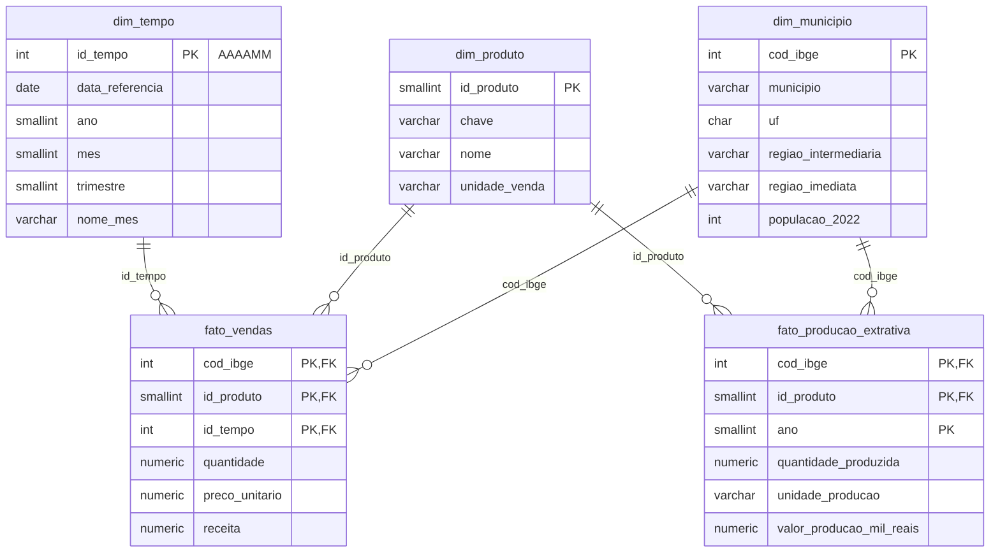
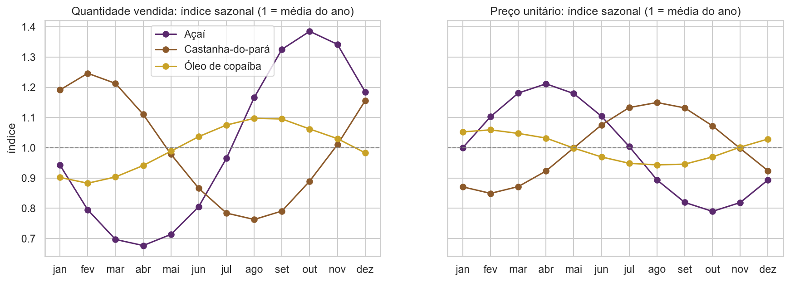
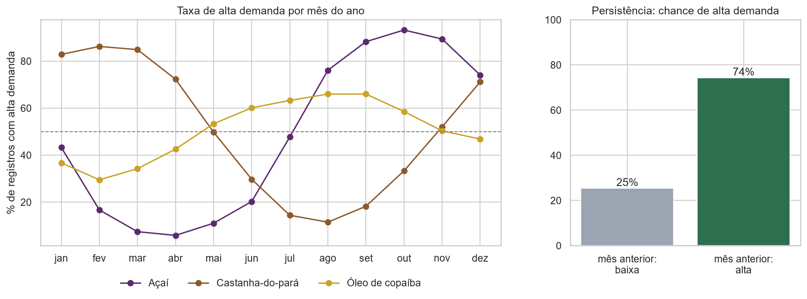
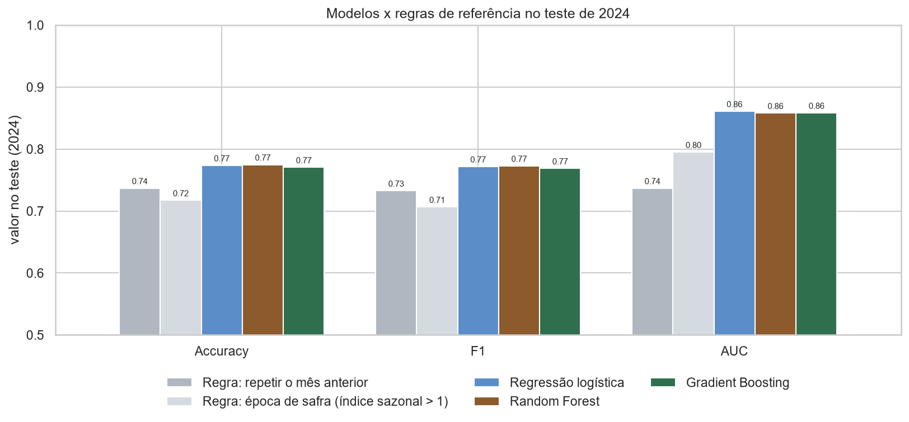

# Previsão de Alta Demanda de Produtos da Bioeconomia Amazônica

Projeto Integrador (P15) da disciplina **Banco de Dados e Engenharia de Dados para IA**, Prof. Adolfo Colares, Especialização em Inteligência Artificial da [UNIFAP – Universidade Federal do Amapá](https://www.unifap.br/).

Autor: Leonam Souza dos Santos Azevedo

## Objetivo

Construir um pipeline end-to-end de Engenharia de Dados e Machine Learning que prevê se um município terá **alta ou baixa demanda** de um produto da bioeconomia (açaí, castanha-do-pará e óleo de copaíba) em determinado mês, nos estados do Amapá, Pará e Amazonas.

```
Fontes de Dados → PostgreSQL → ETL Python → Features → Machine Learning → Métricas → Resultados
```

## Fontes de dados

| # | Fonte | Tipo | O que fornece | Arquivo bruto |
|---|-------|------|---------------|---------------|
| 1 | [API de Localidades do IBGE](https://servicodados.ibge.gov.br/api/docs/localidades) | Pública, real | Municípios de AP, PA e AM e suas regiões geográficas | `ibge_municipios_<UF>.json` |
| 2 | [SIDRA tabela 4709](https://sidra.ibge.gov.br/tabela/4709) (Censo 2022) | Pública, real | População residente por município | `sidra_4709_populacao_<UF>.json` |
| 3 | [SIDRA tabela 289](https://sidra.ibge.gov.br/tabela/289) (PEVS) | Pública, real | Produção extrativa (quantidade e valor) por município, produto e ano | `sidra_289_pevs_<UF>_<ANO>.json` |
| 4 | Relatório de vendas | **Simulada** | Vendas mensais por município e produto (jan/2022 a dez/2024) | `vendas_simuladas.csv` |

### Sobre a fonte simulada

Não existe base pública de vendas mensais desses produtos por município, então as vendas são **simuladas** pelo script `src/gerar_vendas.py`, ancoradas nos dados reais do IBGE:

- a demanda cresce com a **população** do município (Censo 2022);
- a demanda e o preço respondem à **produção extrativa do ano anterior** (PEVS), pois a PEVS de um ano só é publicada no ano seguinte;
- há **sazonalidade simplificada** por produto (pico do açaí em outubro, da castanha em fevereiro, copaíba quase estável);
- há **tendência** de crescimento de 5% ao ano e **ruído com memória** (AR(1));
- o preço cai na safra e onde há mais produção local.

Os parâmetros da simulação estão em `src/config.py` e a semente aleatória é fixa (`SEED = 42`), então a base é reproduzível.

### Problemas de qualidade inseridos de propósito

Para que o ETL tenha o que tratar, como numa base real, o gerador insere:

| Problema | Proporção | Como o ETL vai tratar |
|----------|-----------|-----------------------|
| Nome do produto com grafias diferentes (`acai`, `AÇAÍ`, `castanha do para`...) | 15% | Padronização por texto normalizado |
| Mês em formato `MM/AAAA` em vez de `AAAA-MM` | 10% | Conversão para data única |
| Nome do município em caixa alta | 5% | Uso do código IBGE como chave |
| Código IBGE ausente | 0,5% | Recuperação por nome do município + UF |
| Preço unitário ausente | 1,5% | Recálculo por receita / quantidade |
| Quantidade 100x maior (erro de digitação) | 0,3% | Detecção pelo preço implícito e correção |
| Quantidade com sinal trocado | 0,2% | Correção do sinal |
| Linhas duplicadas | 0,8% | Remoção de duplicatas |

## Estrutura do repositório

```
p15-projeto-integrador/
├── README.md
├── requirements.txt
├── .env.example          # modelo da conexão com o PostgreSQL
├── data/
│   ├── raw/              # dados brutos, exatamente como recebidos
│   └── processed/        # cópia em CSV das tabelas do dw (gerada pelo ETL)
├── sql/
│   ├── 01_estrutura.sql            # Etapa 2: schemas, tabelas, chaves e índices
│   ├── 02_verificacao_staging.sql  # Etapa 2: consultas de verificação da staging
│   └── 03_verificacao_dw.sql       # Etapa 3: consultas no modelo estrela
├── src/
│   ├── config.py         # escopo, parâmetros e caminhos
│   ├── utils.py          # leitura dos formatos do IBGE
│   ├── db.py             # conexão com o PostgreSQL (lê o .env)
│   ├── extract.py        # Etapa 1: coleta das fontes públicas
│   ├── gerar_vendas.py   # Etapa 1: geração da fonte de vendas simulada
│   ├── setup_db.py       # Etapa 2: cria o banco e a estrutura
│   ├── load_staging.py   # Etapa 2: carrega data/raw na staging
│   ├── transform.py      # Etapa 3: regras de transformação (funções puras)
│   ├── etl.py            # Etapa 3: staging → modelo dimensional
│   ├── leitura.py        # Etapa 4: leitura do dw (PostgreSQL ou CSV) e base de vendas
│   ├── features.py       # Etapa 5: variável alvo e features (só informação até t-1)
│   ├── build_features.py # Etapa 5: gera a base de modelagem (ml.features_demanda)
│   ├── modelagem.py      # Etapa 6: modelos, validação temporal e métricas
│   └── train.py          # Etapa 6: treina, avalia e salva o modelo final
├── notebooks/
│   ├── 01_eda.ipynb      # Etapa 4: análise exploratória
│   ├── 02_features.ipynb # Etapa 5: engenharia de features e teste de vazamento
│   └── 03_modelo.ipynb   # Etapa 6: treinamento, comparação e análise do modelo
├── models/
│   └── modelo_alta_demanda.pkl  # pipeline final + metadados
└── reports/
    ├── qualidade_etl.csv # relatório de qualidade do ETL
    ├── dicionario_features.csv
    ├── metricas_modelos.csv      # comparação dos modelos no teste
    ├── metricas_por_produto.csv
    ├── importancia_features.csv
    └── figuras/          # gráficos gerados pelos notebooks
```

## Modelagem no PostgreSQL

O banco `bioeconomia` tem duas camadas, uma por schema:

| Schema | Papel | Características |
|--------|-------|----------------|
| `staging` | Recebe os dados brutos das 4 fontes | Tudo em `TEXT`, sem restrições: guarda o dado exatamente como chegou, inclusive os símbolos do IBGE (`-`, `...`, `X`) e os erros das vendas. Cada linha registra o arquivo de origem e o horário da carga. |
| `dw` | Modelo dimensional (estrela) tratado pelo ETL | Tipos corretos, chaves primárias e estrangeiras, `CHECK` de valores válidos e índices. |
| `ml` | Base de modelagem e resultados | `ml.features_demanda` (features e alvo), `ml.metricas_modelos` (comparação dos modelos) e `ml.previsoes_teste` (previsões de 2024). |

Separar as camadas permite reprocessar o ETL sem baixar os dados de novo e auditar qualquer valor tratado comparando com o original na staging.

### Modelo dimensional (schema `dw`)



Decisões de modelagem:

- **Duas tabelas fato com dimensões compartilhadas:** vendas (mensal) e produção extrativa (anual) têm granularidades diferentes, então ficam em fatos separados ligados pelas mesmas dimensões de município e produto.
- **Chave primária composta na `fato_vendas`** (município, produto, mês): garante no próprio banco que não existe venda duplicada para a mesma combinação.
- **`id_tempo` no formato AAAAMM:** legível e ordenável (ex.: `202410`).
- **`NULL` na produção extrativa significa "dado não disponível no IBGE"**, diferente de zero (símbolo `-` do SIDRA).
- **`dw.log_qualidade_etl`** guarda, a cada execução do ETL, quantos registros cada regra corrigiu ou descartou, formando um histórico auditável.

## ETL em Python

O ETL (`src/etl.py`) lê a staging do PostgreSQL, aplica as regras de `src/transform.py` e grava o modelo dimensional em uma única transação: se algo falhar, o `dw` não fica pela metade. O `dw` é sempre reconstruído do zero a partir da staging, então o ETL pode ser executado quantas vezes for preciso com o mesmo resultado.

### Regras aplicadas às vendas

A ordem das regras importa: por exemplo, o sinal da quantidade é corrigido antes da checagem de consistência com a receita.

| # | Regra | Como funciona |
|---|-------|---------------|
| 1 | Duplicatas | Remove linhas idênticas |
| 2 | Produto | Normaliza o texto (minúsculas, sem acentos) e identifica o produto por palavra-chave: `AÇAÍ`, ` Açaí ` e `acai` viram o mesmo produto |
| 3 | Mês | Aceita `AAAA-MM` e `MM/AAAA` e converte para o `id_tempo` (AAAAMM) |
| 4 | Código IBGE ausente | Recupera pelo nome do município (normalizado) + UF, usando o cadastro do IBGE |
| 5 | Nome do município | O nome digitado é descartado; o nome oficial vem da `dim_municipio` |
| 6 | Sinal da quantidade | Quantidade negativa tem o sinal corrigido |
| 7 | Erro de digitação | Se quantidade × preço difere da receita em mais de 5%, a receita é tomada como confiável e a quantidade é recalculada por receita ÷ preço |
| 8 | Preço ausente | Recalculado por receita ÷ quantidade |
| 9 | Preço implausível | Descarta registros com preço fora de 0,2x a 5x a mediana do produto (casos sem informação suficiente para correção segura) |
| 10 | Chave única | Garante uma única linha por município, produto e mês |

Na PEVS, o ETL mantém só os 3 produtos do projeto, converte o símbolo `-` em zero e `...`, `..` e `X` em `NULL`.

### Validação do ETL

Como as vendas são simuladas, existe um gabarito: a base antes da inserção dos erros. Nos testes, o ETL recuperou exatamente os valores originais de quantidade, preço e receita em todos os registros gravados; apenas um registro foi descartado, por acumular dois erros na mesma linha (quantidade 100x maior e preço ausente).

O relatório completo de cada execução fica em `reports/qualidade_etl.csv` e na tabela `dw.log_qualidade_etl`.

## Análise exploratória

O notebook `notebooks/01_eda.ipynb` lê o modelo estrela direto do PostgreSQL (ou de `data/processed`, se o banco não estiver disponível) e orienta as escolhas de modelagem.

### Variável alvo

`alta_demanda = 1` quando a quantidade vendida no mês supera a **média dos 12 meses anteriores** do mesmo município e produto. O alvo compara cada município com o próprio histórico, usa apenas meses passados e existe de jan/2023 a dez/2024 (2022 serve de histórico).

### Principais achados

- **Volume dominado pela população:** a relação entre população e vendas é quase linear em escala log-log. Por isso o alvo é relativo ao histórico de cada município, e variáveis de volume entram em log ou como razões.
- **Sazonalidade forte e própria de cada produto:** o açaí tem pico em outubro e vale em abril; a castanha-do-pará, pico em fevereiro e vale em agosto; o óleo de copaíba varia pouco. O preço se move no sentido oposto à quantidade.
- **Persistência:** depois de um mês de alta demanda, a chance de outro mês de alta é bem maior, o que justifica features de defasagem.
- **Produção local:** municípios que produziram no ano anterior vendem mais por habitante, mas a produção quase não se correlaciona com o alvo mensal; entra no modelo apenas como contexto.





## Engenharia de features

A base de modelagem (`src/features.py`, gerada por `python -m src.build_features`) tem uma linha por município, produto e mês de 2023 e 2024, gravada em `ml.features_demanda` e em `data/processed/features_modelo.csv`.

**Regra principal: nenhuma feature usa informação do próprio mês previsto ou do futuro.** Tudo é calculado com dados até o mês anterior (t-1), e as defasagens seguem o calendário, não a posição da linha na tabela.

| Grupo | Features | Achado da EDA que motivou |
|-------|----------|---------------------------|
| Memória recente | `log_razao_lag1`, `log_razao_lag2`, `log_razao_media3`, `log_variacao_lag1`, `alta_mes_anterior` | Persistência entre meses consecutivos |
| Sazonalidade | `log_razao_lag12`, `indice_sazonal_hist`, `mes_seno`, `mes_cosseno` | Calendário de safra próprio de cada produto |
| Preço | `log_preco_rel_lag1` | Preço se move no sentido oposto à quantidade |
| Contexto | `log_populacao`, `log_producao_ano_anterior`, `produz_no_municipio`, `producao_indisponivel`, `chave` (produto), `uf` | Diferenças de patamar entre municípios e produtos |

As variáveis de volume entram como log da razão sobre a média dos 12 meses anteriores, o que põe municípios de tamanhos muito diferentes na mesma escala. A descrição de cada feature está em `reports/dicionario_features.csv`.

**Teste automático de vazamento:** o notebook `02_features.ipynb` altera artificialmente as vendas de um mês e recalcula todas as features. Nenhuma feature daquele mês ou dos anteriores muda, e as dos meses seguintes mudam, o que comprova que o teste é sensível e que não há vazamento.

**Divisão temporal:** treino em 2023 e teste em 2024, sem embaralhar, reproduzindo o uso real do modelo.

## Modelo de classificação

O treinamento (`src/modelagem.py`, executado por `python -m src.train`) segue uma metodologia que evita resultados otimistas:

- **Treino em 2023 e teste em 2024**, sem embaralhar. O teste é usado uma única vez, na avaliação final.
- **Seleção por validação temporal dentro de 2023**, com janela crescente: treina até junho e valida em julho e agosto; até agosto, valida em setembro e outubro; até outubro, valida em novembro e dezembro. Hiperparâmetros e modelo final são escolhidos pela média do F1 nessa validação, nunca pelo teste.
- **Pré-processamento dentro do pipeline** (imputação, padronização e codificação), ajustado só com os dados de treino de cada etapa.
- **Comparação com duas regras sem aprendizado:** "repetir o resultado do mês anterior" e "época de safra (índice sazonal > 1)".

| Modelo | Papel |
|--------|-------|
| Regra: repetir o mês anterior | Referência forte, explora a persistência da demanda |
| Regra: época de safra | Referência sazonal |
| Regressão logística | Modelo linear interpretável |
| Random Forest | Conjunto de árvores, captura interações |
| Gradient Boosting (HistGradientBoosting) | Árvores sequenciais, trata valores ausentes nativamente |

**Métricas:** Accuracy, F1 (principal), precisão, recall e AUC no teste de 2024. Os resultados ficam em `reports/metricas_modelos.csv` e em `ml.metricas_modelos`; o notebook `03_modelo.ipynb` traz a matriz de confusão, a curva ROC, o desempenho por produto e por mês, a importância das features e a análise de onde vem o ganho do modelo.



O modelo final é salvo em `models/modelo_alta_demanda.pkl` com o pipeline completo e os metadados (features, parâmetros, período de treino, métricas e versão do scikit-learn).

## Como executar

Pré-requisitos: Python 3.10+, Git e PostgreSQL (testado nas versões 16 e 18).

No Windows (PowerShell), dentro da pasta do projeto:

```powershell
python -m venv .venv
.\.venv\Scripts\Activate.ps1
pip install -r requirements.txt

# Etapa 1: coleta
python -m src.extract          # baixa as fontes do IBGE para data/raw
python -m src.gerar_vendas     # gera data/raw/vendas_simuladas.csv

# Etapa 2: banco de dados
copy .env.example .env         # depois edite o .env com a senha do PostgreSQL
python -m src.setup_db         # cria o banco bioeconomia e as tabelas
python -m src.load_staging     # carrega data/raw na staging

# Etapa 3: ETL
python -m src.etl              # staging → modelo dimensional (dw)
```

Etapa 4: abra `notebooks/01_eda.ipynb` no VS Code (ou no Jupyter), selecione o kernel do `.venv` e execute todas as células. As figuras são salvas em `reports/figuras/`.

Etapa 5:

```powershell
python -m src.build_features   # gera ml.features_demanda e data/processed/features_modelo.csv
```

Depois execute `notebooks/02_features.ipynb`, que documenta as features, roda o teste de vazamento e confere a base gravada.

Etapa 6:

```powershell
python -m src.train            # treina, compara, salva o modelo e grava métricas e previsões
```

Depois execute `notebooks/03_modelo.ipynb` para a análise completa dos resultados.

Os arquivos do IBGE ficam em cache em `data/raw/`; para baixar de novo, use `python -m src.extract --force`. Para recriar as tabelas do zero, use `python -m src.setup_db --recriar`.

Para conferir a carga no SQL Shell (psql), a partir da pasta do projeto:

```
\! chcp 65001
\cd 'C:/p15-projeto-integrador'
\i sql/02_verificacao_staging.sql
\i sql/03_verificacao_dw.sql
```

## Andamento

- [x] Etapa 1: estrutura do repositório e coleta de dados (2+ fontes)
- [x] Etapa 2: modelagem no PostgreSQL e carga dos dados brutos (staging)
- [x] Etapa 3: ETL em Python (staging → modelo dimensional)
- [x] Etapa 4: análise exploratória (notebook)
- [x] Etapa 5: engenharia de features
- [x] Etapa 6: modelo de classificação e métricas
- [ ] Etapa 7: documentação final e notebook de entrega
